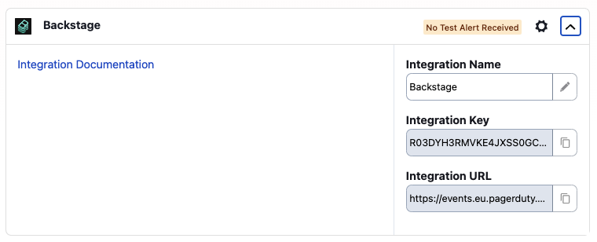

# Custom events URL

The default URL used for events is `https://events.pagerduty.com/v2`. It is possible to override this URL through configuration. Add the following configuration to `app-config.yaml`:

```yaml
pagerDuty:
  eventsBaseUrl: 'https://events.pagerduty.com/v2'
```

!!! note
    **PagerDuty accounts based in Europe use a different URL** so you need to override it here if that is your case.

    The correct url can be found in the Backstage integration page for your service on the PagerDuty console.

    