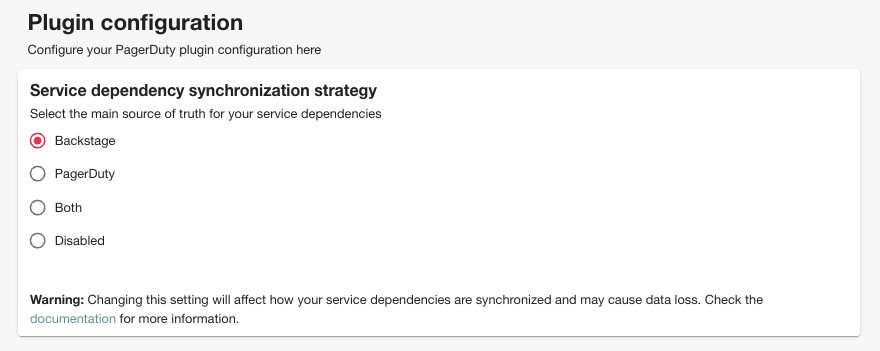

# Configure service dependency sync

The PagerDuty plugin allows users, that use Backstage are their service catalog, to sync the dependencies automatically to the corresponding PagerDuty services.

This feature is very powerfull for users that want to leverage [PagerDuty Status Pages](https://www.pagerduty.com/platform/business-ops/status-pages/) properly but are limited by the fact that they don't have service dependencies configured in PagerDuty. With this feature, the plugin will do this automatically for you.

!!! note
    Only the Backstage entities that have corresponding services in PagerDuty will get their service dependencies mapped. This feature is powered by the `CatalogProcessor` and therefore if you make changes on your Backstage entity configuration they will, in time, be mapped to PagerDuty.

    These changes might not reflect immediatelly because the `CatalogProcessor` runs on a schedule and the plugin doesn't have control over that. Backstage admins can configure the frequency in which the entities are processed.

This feature is **disabled** by default but can easily be enabled on the PagerDuty advanced configuration page. If you haven't enabled it yet you can do so by following the instructions in [here](/backstage-plugin-docs/advanced/service-entity-mapping/#adding-the-pagerdutypage-component).

Here you can choose:

- to use **Backstage as the main source** and the plugin will automatically add/remove service dependencies to your mapped entities in PagerDuty
- to set **PagerDuty as the main source** and the plugin will automatically add/remove entity relations in Backstage
- to **merge service dependencies** from Backstage and PagerDuty
- to keep it **disabled**.

!!! note
    The syncing mechanism will overwrite all services on the destination so use this mechanism carefully.

    **Example:** You set Backstage as your main source and you already have service dependencies in PagerDuty. Those will be overwritten has Backstage is now configured as the source of thruth.
