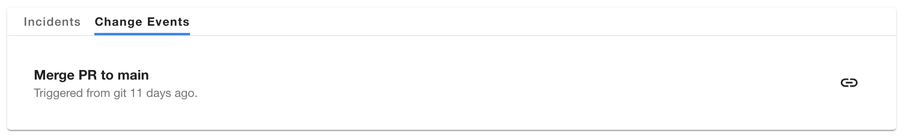
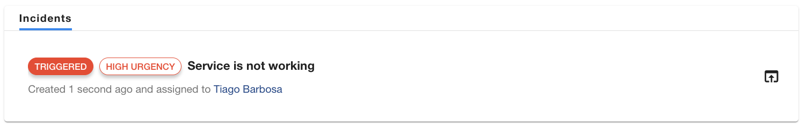

# Hide change events

The PagerDuty plugin allows users to view the recent changes made to components integrated with their PagerDuty service. This feature is enabled by default but you can choose to disable it.



!!! note
    In order to ingest __change events__ in PagerDuty you need to have an AIOps license. If you don't have one, or you are missing the necessary permissions, you will see the following error.

    

    This is one of the reasons why users might want to disable this capability. PagerDuty has decided not to hide the tab automatically due to its relevance in the incident operations process.

## How to hide the Change Events tab?

To suppress the rendering of the change events tab, the `PagerDutyCard` can be instantiated with a `disableChangeEvents` option as shown below.

```html
<EntityPagerDutyCard disableChangeEvents>
```

This will hide the change events tab for all users and prevent recent changes from being visible in Backstage.


