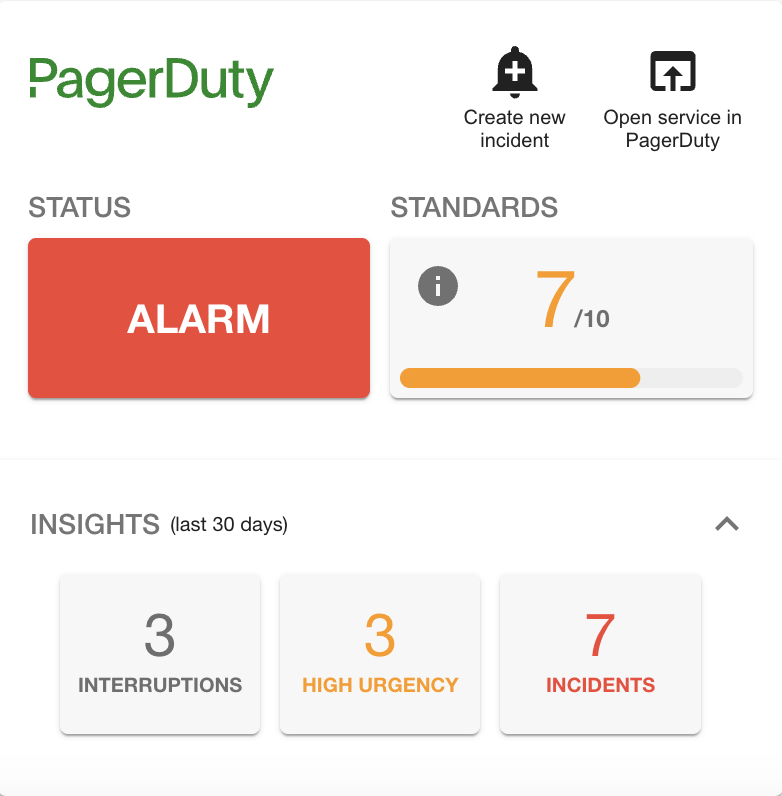

# Hide 'insights' section

The PagerDuty plugin allows users to view relevant metrics for the service. This feature is enabled by default but you can choose to completely hide it.

!!! note
    This capability is only available for the `PagerDutySmallCard` at this point in time.



To suppress the rendering of the insights section, the `PagerDutySmallCard` can be instantiated with a `disableInsights` option as shown below.

```html
<EntityPagerDutySmallCard disableInsights>
```

This will hide the *insights* tab for Backstage users.


