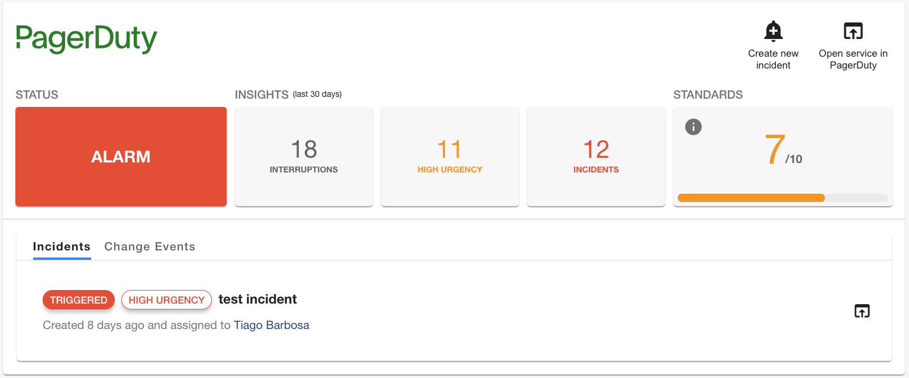

# Hide 'on-call' section

The PagerDuty plugin allows users to view who is currently on-call for the escalation policy assigned to the service. This feature is enabled by default but you can choose to completely hide it.


To suppress the rendering of the on-call section, the `PagerDutyCard` can be instantiated with a `disableOnCall` option as shown below.

```html
<EntityPagerDutyCard disableOnCall>
```

This will hide the on-call tab for Backstage users.



!!! note
    This feature is also available for other cards such as `PagerDutySmallCard`.

    ```html
    <EntityPagerDutySmallCard disableOnCall>
    ```
    
    
