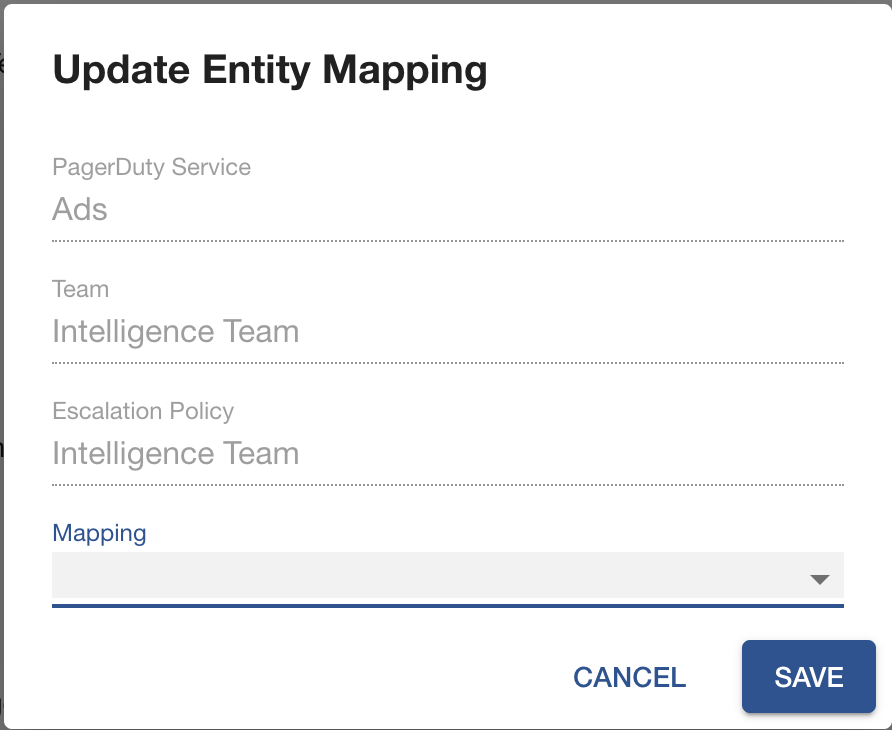

# Mapping PagerDuty Services to Backstage Entities

Users of PagerDuty plugin for Backstage are typically customers of PagerDuty that have started to use Backstage as their Internal Developer Portal. This means they start from an existing base of PagerDuty services that they need to manually configure to have them show up in Backstage.

This can of course be automated through the use of PagerDuty's APIs but it's still something that requires human effort and for some teams it is difficult to justify the investment.

For that reason we create a `PagerDutyPage` component that is intended to be the single place for advanced configurations related to this plugin.

> At this point in time the `PagerDutyPage` only allows Admins to map existing PagerDuty services to Backstage entities. Other features will be released in the future.

## Installing dependencies

In order to set this up in your Backstage instance you should install the necessary packages first by running the following command. This command will install the entity processor module that we will configure later on.

```bash
yarn add --cwd packages/backend @pagerduty/backstage-plugin-entity-processor
```

!!! note
    The following instructions assume that you already installed the frontend and backend plugin as described in the [Getting Started page](/backstage-plugin-docs/getting-started/backstage).

## Configuring the Entity Processor

The Entity Processor module is one of the key components of this capability as it allows for entity mapping configurations that were persisted into the Backstage database to be applied to each Backstage entity configuration.

You can enable the entity processor in your Backstage instance by injecting the dependency in the backend system in `packages/backend/index.ts`.

```typescript
  import { createBackend } from '@backstage/backend-defaults';

  const backend = createBackend();
  
  ...

  backend.add(import('@pagerduty/backstage-plugin-entity-processor')); // <-- This is the line you want to add
  
  backend.start();
```

And that is it for the entity processor module. This module will process all Backstage entities and if there are any changes persisted to the database they will be applied automatically.

## Adding the PagerDutyPage component

Now that we have taken care of the backend configurations we need to expose the mapping features to the Backstage Admins. You do this in two steps.

1. Add a route to the new page that will contain the `PagerDutyPage` component

  In `packages/app/src/App.tsx` import the `PagerDutyPage` component from `@pagerduty/backstage-plugin` by using the following command.

  ```typescript
    import { PagerDutyPage } from '@pagerduty/backstage-plugin';
  ```
  
  Add a new route to your routes list.

  ```typescript
      const routes = (
      <FlatRoutes>
        ...
        <Route path="/pagerduty" element={<PagerDutyPage />} />
      </FlatRoutes>
    );
  ```

2. Add the PagerDuty option to the navigation menu

  In `packages/app/src/components/Root/Root.tsx` import the `PagerDutyIcon` component from `@pagerduty/backstage-plugin` by using the following command.

  ```typescript
    import { PagerDutyIcon } from '@pagerduty/backstage-plugin';
  ```
    
  Add the menu option to navigate to the new /pagerduty route.

  ```typescript
      export const Root = ({ children }: PropsWithChildren<{}>) => (
      <SidebarPage>
        <Sidebar>
          ...
          <SidebarGroup label="Menu" icon={<MenuIcon />}>
            ...
            <SidebarItem icon={PagerDutyIcon} to="pagerduty" text="PagerDuty" />
            ...
          </SidebarGroup>
        </Sidebar>
        {children}
      </SidebarPage>
    );
  ```

Now, Backstage Admins will have the option to configure the mapping between PagerDuty services and Backstage entities using a UI.

## Mapping services to entities

Once you navigate to the new `/pagerduty` route will see a page similar to the one below. On the table you will see a list of all your PagerDuty services, it's current mapping and the mapping status.


To define the mapping between existing PagerDuty services and Backstage entities you need to select the edit option on the right. Once you do so, a new modal screen will pop-up. Here, you can choose from a list of available Backstage entities that you want to map to the PagerDuty service.

!!! warning
    Currently we only support 1:1 mapping between PagerDuty services and Backstage entities due to a limitation on the `PagerDutyCard` that only supports one service at a time. There is work in progress to overcome this limitation.



Once you select a new mapping, Backstage Entity Processor will be instructed to run and update the Backstage entity configuration. This is a best-effort action and the configuration update might not be immediate.

## Check mapping status

Mappings defined on this page are not persisted to source code but instead kept in Backstage database. For this reason, we allow you to check the mapping status for each PagerDuty service. The status might take one of the following values:

- **In Sync:** The PagerDuty configurations on the Backstage entity are in sync between the database and the configuration file.
- **Out of Sync:** The configurations in the database and the configuration file do not match. In this occasion, the values from the database will take precedence as they are considered to be overrides.
- **Not Mapped:** The PagerDuty service is not mapped to any Backstage entity.

With this information the user can chose whether to manually persist the override to the source code and therefore ensure the configuration is in sync.

!!! note
    We are evaluating an option to automatically create a PR in the source repo for the Backstage entity to ease the process of ensuring that configurations are in sync. Still, this feature is not available yet.

And there you go. This is all you need to do to map your existing PagerDuty services to Backstage entities in an easier manner.
