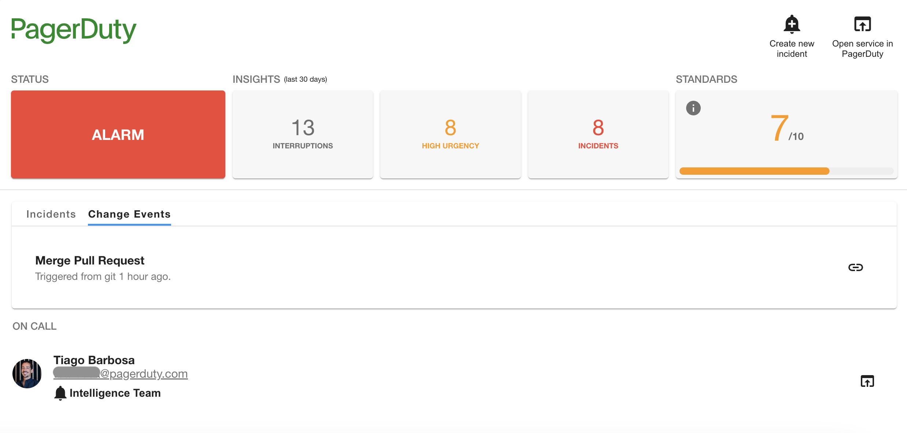

# Plugin capabilities

The purpose of the PagerDuty plugin for Backstage is to bring some of the capabilities of PagerDuty into Backstage to reduce distractions and provide users more visibility on the status of each service.

Currently the plugin provides a limited set of features that we view as the core capabilities used by Developers, Platform Engineers, SREs and other type of stakeholders. Theses are listed below.

## View any open incidents

The plugin list all open incidents on a specific service and allows you to navigate to the incident detail page on PagerDuty console.

## View change events associated to a service

See all recent changes sent to PagerDuty through integrations like GitHub, GitLab, Azure DevOps and many others. If your service is running into issues you can quickly identify recent changes that might be related to the root cause of the incident in the first place.

## See and contact on call staff

Quickly check who is on call for your service and reach out if necessary. The plugin allows you to email the on call person directly or open the user profile in PagerDuty.

## Trigger an incident for a service

The PagerDuty plugin allows users to create incidents directly from Backstage. You only need to specify a description for the problem you are having with the service and an incident will be created in PagerDuty.

!!! note
    This feature can be disabled if you don't want users to create incidents manually from Backstage. To do so check the steps on how to [enable read-only mode](/advanced/enable-read-only-mode/).

## The future

We are actively working on new capabilities based on user feedback and requests. If you have ideas or bugs to report we appreciate that you use the project's [Issues](https://github.com/PagerDuty/backstage-plugin/issues) page and let us know.
