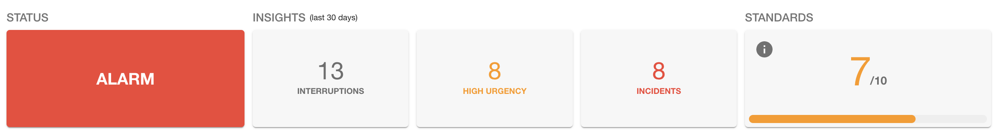
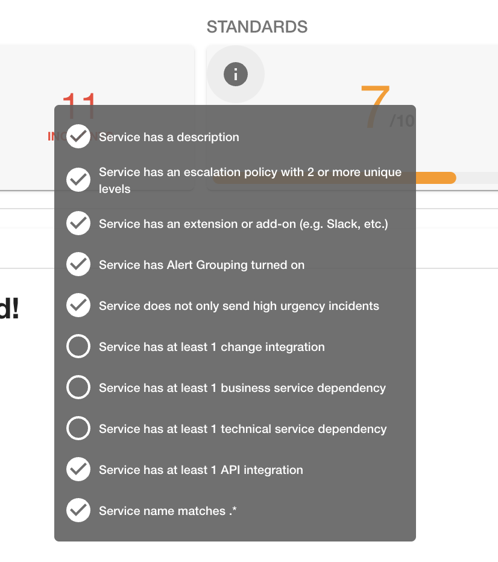
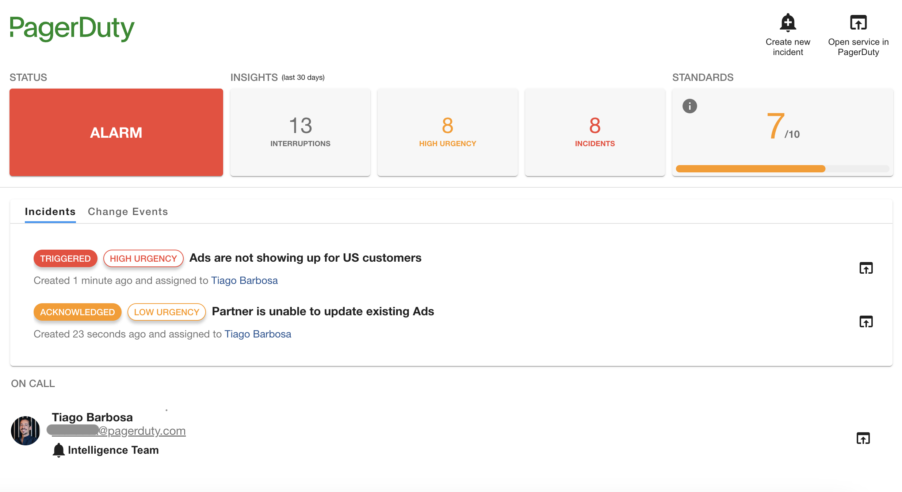
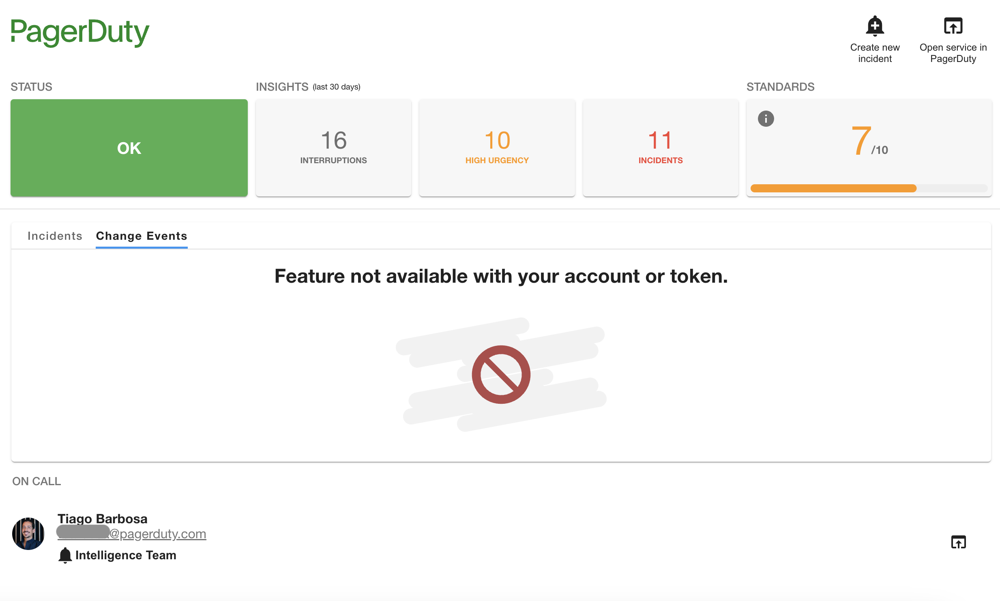

# Plugin capabilities

The purpose of the **PagerDuty plugin for Backstage** is to bring some of the capabilities of PagerDuty into Backstage to reduce distractions and provide users more visibility on the status of each service.

Currently the plugin provides a limited set of features that we view as the core capabilities used by Developers, Platform Engineers, SREs and other type of stakeholders. Theses are listed below.

## Frontend

The frontend plugin (`@pagerduty/backstage-plugin`) allows users to add a PagerDuty Card to their service pages which provides the following set of features.

### Quick view on current service status

The plugin provides an easy mechanism to check the current status for the service, as well as some insights for the last 30 days and how well you are complying to Service Standards.

!!! note
    By hovering the mouse over the information button on Service Standards card you will see a list of all the Service Standards and whether you are compliant or not.

    

### View any open incidents

The plugin lists all open incidents on a specific service and allows you to navigate to the incident detail page in PagerDuty.

### View change events associated to a service

See all recent changes sent to PagerDuty through integrations like GitHub, GitLab, Azure DevOps and many others. If your service is running into issues you can quickly identify recent changes that might be related to the root cause of the incident.

!!! Note
    This feature is available with our [PagerDuty AIOps add-on](https://support.pagerduty.com/docs/aiops). If your account does not have support for *change events* you might see the following screen instead of a list of changes.

    

### See and contact on call staff

Quickly check who is on call for your service and reach out if necessary. The plugin allows you to see the escalation policy that the on-call user is assigned to and navigate to PagerDuty for more details.

### Trigger an incident for a service

The PagerDuty plugin allows users to create incidents directly from Backstage. You only need to specify a description for the problem you are having with the service and an incident will be created in PagerDuty.

!!! note
    This feature can be disabled if you don't want users to create incidents manually from Backstage. To do so check the steps on how to [enable read-only mode](/backstage-plugin-docs/advanced/enable-read-only-mode/).

### Map existing PagerDuty services to Backstage entities

The PagerDuty plugin for Backstage allows Admins to add a `PagerDutyPage` component to their Backstage installation in order to easily map their existing PagerDuty services to Backstage entities without the need to make code changes to the service configuration.

!!! warning
    This feature currently supports 1:1 mapping between services and entities due to a limitation on the `PagerDutyCard` that only allows one service to be configured at a time.

This feature leverages the entity processor module to make the necessary updates to each Backstage entity configuration. The `PagerDutyPage` allows admins to see the status of each entity and decide wether to make the necessary change in source code to ensure the configuration is in sync.

### Sync service dependencies between Backstage and PagerDuty

The PagerDuty plugin allows users to keep service dependencies in-sync between Backstage and PagerDuty in an automated way. This feature is disabled by default but you can easily enable it in the PagerDuty Advanced Configurations Page in `PagerDutyPage`.

This feature allows you to sync service dependencies from Backstage to PagerDuty or merge the dependencies from both sides.

!!! note
    Due to a Backstage design decision it is not possible to fully overwrite the relations specified in each entity's configuration file.

    For that reason the option to synchronise strictly from PagerDuty side is not available.

## Backend

The backend plugin (`@pagerduty/backstage-plugin-backend`) enables additional security when using the PagerDuty APIs and enables easy adoption of PagerDuty best practices through custom Backstage Scaffolder actions.

### Create PagerDuty services from project templates

The PagerDuty backend plugin exposes a custom action that can be used in project templates to streamline the process of onboarding services into PagerDuty whenever a new service is created from a Backstage template.

Follow [these steps](../advanced/create-service-software-template) to add the custom action to a template.

!!! warning
    **Alert Grouping** requires certain capabilities available in AIOps and Event Intelligence which are present in certain licensing models only.

    If your account doesn't have these capabilities, alert grouping will sillently be ignored.

## The future

We are actively working on new capabilities based on user feedback and requests. If you have ideas or bugs to report we appreciate that you use the project's [Issues](https://github.com/PagerDuty/backstage-plugin/issues) page and let us know.
