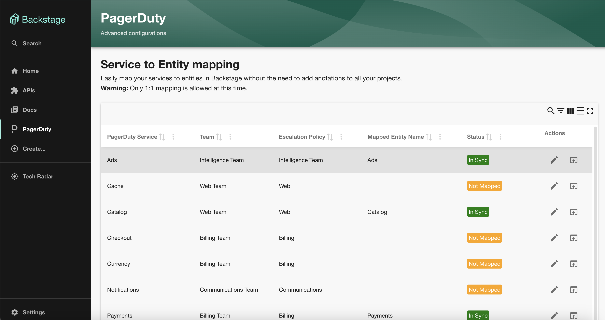

# PagerDutyPage Component

The `PagerDutyPage` is a Page component that Backstage Admins can add to the Backstage menu. This page is the entry point for advanced configurations related to the PagerDuty plugin for Backstage. Using this component you can:

- map existing PagerDuty services to Backstage entities
- see the synchronization status between your configuration file and overrides done on this page

You can add `PagerDutyPage` to your Backstage application easily by following the steps highlighted in [Mapping PagerDuty Services to Backstage Entities](/backstage-plugin-docs/advanced/service-entity-mapping).
