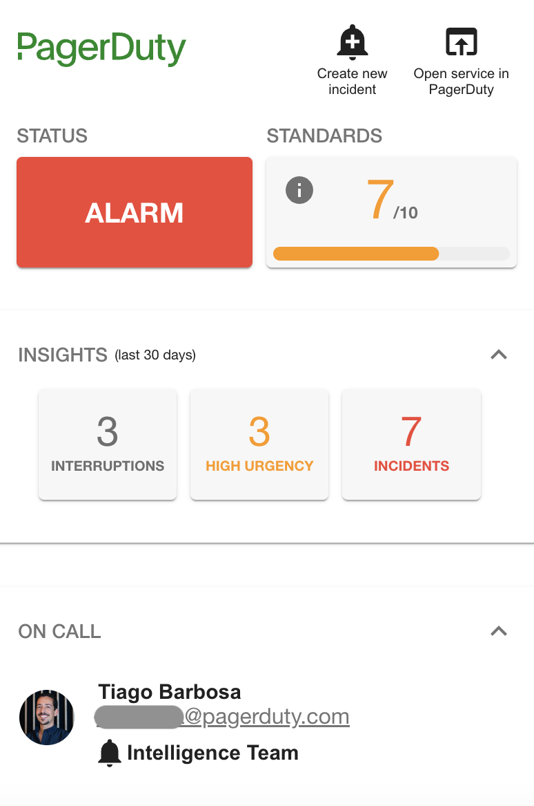

# PagerDutySmallCard Component

The `PagerDutySmallCard` is a component initially contributed by community members that you can add to the Entity page. This card presents similar information to `PagerDutyCard` but in a smaller form factor. It allows you to:

- check the **status** of your service
- access relevant **service metrics**
- track **service standards** compliance
- check who is **on call**
- **open the service** in PagerDuty
- **create new incidents**

This card doesn't show any *incidents* or *recent changes* as the idea is to be able to quickly the service status and use as less space on the screen as possible. For this reason we moved the *insights* and *on call* sections into collapsable panels that can be expanded when needed.

You can add the `PagerDutySmallCard` to your Backstage application easily by following the steps highlighted in [Configuring Backstage](/backstage-plugin-docs/getting-started/backstage) but use the `PagerDutySmallCard` instead.

The *on call* and *insights* tabs can be removed from the Card by following the steps detailed in [hide on call](/backstage-plugin-docs/advanced/hide-oncall) and [hide insights](/backstage-plugin-docs/advanced/hide-insights).

You can optionally also disable the chance to *create new incidents* from the card by making it `read-only`. Refer to the [documentation](/backstage-plugin-docs/advanced/enable-read-only-mode) to see how to do it.
