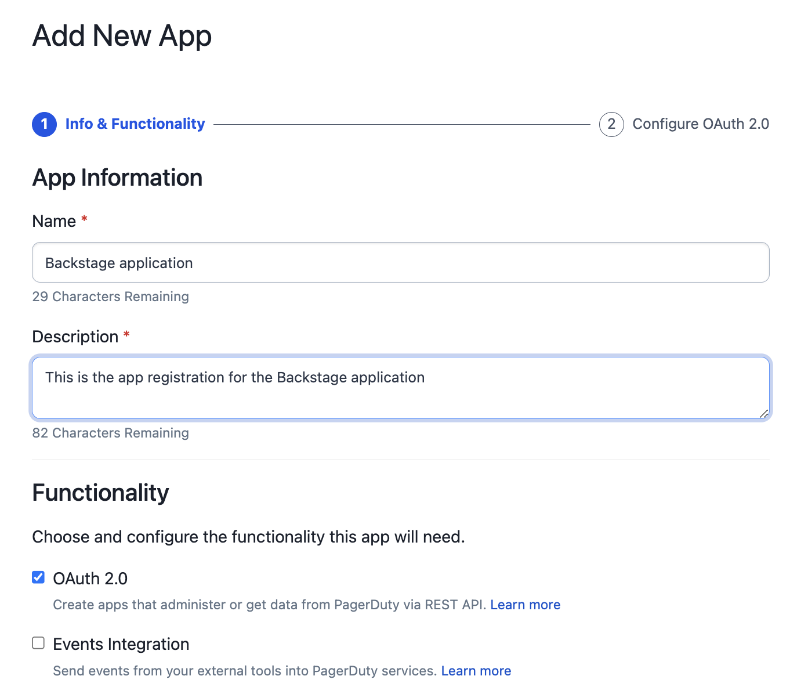
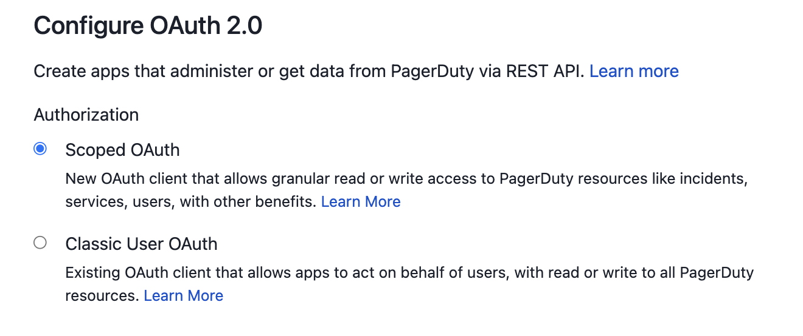

# PagerDuty integration

The **PagerDuty plugin for Backstage** requires some steps to be performed in PagerDuty before you start configuring the plugin in Backstage. Follow the steps below to ensure all requirements are in-place.

!!! warning
    PagerDuty plugin for Backstage relies on the [Events API v2 integration](https://developer.pagerduty.com/api-reference/YXBpOjI3NDgyNjU-pager-duty-v2-events-api) to send events to PagerDuty.

    To setup an integration on a PagerDuty service and generate the necessary authorizations, such as the [API token](https://support.pagerduty.com/docs/api-access-keys) or [register an App](https://developer.pagerduty.com/docs/dd91fbd09a1a1-register-an-app), you need a **PagerDuty Admin role**. If you do not have this role, reach out to a **Global Admin** or **Account Owner** within your organization to request configuration of this plugin.

## Setup PagerDuty

The PagerDuty plugin for Backstage will in essence perform **two types of actions**.

1. Will use the [Events API v2](https://developer.pagerduty.com/api-reference/YXBpOjI3NDgyNjU-pager-duty-v2-events-api) to **send events** to PagerDuty and **trigger incidents** on a specific service.
2. Will use the [PagerDuty REST API](https://developer.pagerduty.com/api-reference/) to **query for service information** that will then be shown in the PagerDuty Card component.

Perform the following steps on PagerDuty before integrating the plugin in Backstage.

### **Create a service integration for Backstage**

Creating a service integration in PagerDuty is the default mechanism to connect services with alerts coming from third-party tools and platforms. In order to create a service integration you can follow **three different approches**:

1. **If you are adding your integration to an existing service:**
     1. From the top menu, select **Services**.
     2. Click the **name** of the service you want to add the integration to.
     3. Go to the **Integrations tab** and click **Add an Integration** button.
     4. Search for the **Backstage** integration, **select it** and click the **Add** button.
     5. An integration will be created and you can see the **integration key** and the **integration endpoint**.

     

    !!! note
        On this screen you can update the integration name to something that allows you to easily identify the Backstage instance you are connecting to.

2. **If you are creating a new service for your integration:** Follow the instructions in the documentation that shows how to [create a service](https://support.pagerduty.com/docs/services-and-integrations#create-a-service) and select **Backstage** as the **Integration Type** in step 5.
3. **If you want to automate service creation with Software Template:** Follow the steps in [Create PagerDuty service with Software Templates](/advanced/create-service-software-template).

Once you complete this step you will be able to configure your services in Backstage to create incidents in PagerDuty by using the **Events API**.

### Setup API Authorization

To use PagerDuty REST APIs you need to have either an **API Token** or a registered Application that will give you the necessary credentials to request a temporary **access token**. Follow **just one** of the following sections as they serve the same purpose but in slightly different ways.

!!! note
    The **API Token** will grant access to all APIs and operations. If this is a security concern, please use **Scoped OAuth** which is now supported in all PagerDuty supported regions and allows you to specify the APIs and operations that Backstage can leverage. This improves security by limiting the given permissions assigned to the token.

    **Scoped OAuth is the recommended approach.**

#### Register an Application for Scoped OAuth (recommended)

In order to use **Scoped OAuth** you need to register an App in PagerDuty. Follow the next steps to register an app, define the necessary permissions and capture the necessary information to generate a temporary access token.

1. Log int to your PagerDuty account
2. From the top menu, select **Integrations**.
3. Select **App Registration** from the menu.
4. Once in the app registration page, select **+ New App**.
5. Provide a **name** and **description** to your app.
6. Select the **OAuth 2.0** check-box, and click **Next**.

    

7. Select **Scoped OAuth** as the preferred Authorization mechanism.
   
8. On permission scope we recommend you to select the following permissions to ensure that the plugin works as expected. Once you select them click on **Register App*.

    ```typescript
        abilities.read // used in scaffolder only
        change_events.read
        escalation_policies.read
        incidents.read
        oncalls.read
        schedules.read
        services.read
        services.write // used in scaffolder only
        teams.read
        users.read
        vendors.read // used in scaffolder only
    ```
    
    !!! warning
        You don't have to assign all the above permissions to your application but not doing so might prevent the plugin from running as expected and you might see some errors on the PagerDuty card.

9. Copy the **Client ID** and **Client Secret** and store them somewhere safe. We will use them later when configuring Backstage.

If you were successful in following the above steps you are ready to move to the [Backstage configuration](/getting-started/backstage).

#### Generate a General Access REST API Token

!!! note
    **General Access Tokens** provide an API token with the **full access** to the PagerDuty Account by default. Still, you can choose to create API tokens with **read-only access** by following the action mentioned on step 4.

To create an API Key to use with Backstage you:

1. Open the **PagerDuty console**
2. Navigate to the **Integrations > API Access Keys**
3. Click **Create new API Key**
4. Enter a Description to help you identify the key later

    !!! note
        For added security you may select the **Read-only API Key** check-box. Current capabilities of this plugin only perform read operations on the API so it is safe to do so.

        

        **This might change in the near future** when new features are added.

5. Click **Create Key**
6. **Copy the key** and **store it** somewhere safe as we will need it later

If you were successful in following the above steps you are ready to move to the [Backstage configuration](/getting-started/backstage).
