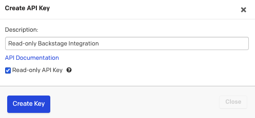

# PagerDuty integration

The PagerDuty plugin for Backstage requires some steps to be performed in PagerDuty before you start configuring the plugin in Backstage. Follow the steps below to ensure all requirements are in-place.

## Requirements

PagerDuty plugin for Backstage relies on the [Events API v2 integration](https://developer.pagerduty.com/api-reference/YXBpOjI3NDgyNjU-pager-duty-v2-events-api) to send events to PagerDuty.

To setup an integration on a PagerDuty service and generate the nexessary authorizations, such as the API token, you need a **PagerDuty Admin role**. If you do not have this role, reach out to a **Global Admin** or **Account Owner** within your organization to request configuration of this plugin.

## Setup PagerDuty

The PagerDuty plugin for Backstage will in essence perform two types of actions.

**One**, will use the [Events API v2](https://developer.pagerduty.com/api-reference/YXBpOjI3NDgyNjU-pager-duty-v2-events-api) to send events to PagerDuty and generate incidents on a specific service. **Two**, will use the [PagerDuty REST API](https://developer.pagerduty.com/api-reference/) to query for service information that will then be shown in the PagerDuty Card component.

Therefore, there are two tasks that we need to perform on PagerDuty side.

1. **Generate a General Access REST API Token**

    !!! note
        General Access Tokens provide an API token with the full access to the PagerDuty Account by default. This might raise a security concern in some implementations and we are looking into alternatives that are already supported by PagerDuty APIs such as scoped API keys.

    To create an API Key to use with Backstage you:

    1. Open the **PagerDuty console**
    2. Navigate to the **Integrations > API Access Keys**
    3. Click **Create new API Key**
    4. Enter a Description to help you identify the key later

        !!! note
            For added security you may select the **Read-only API Key** check-box. Current capabilities of this plugin only perform read operations on the API so it is safe to do so.

            

            **This might change in the near future** when new features are added.

    5. Click **Create Key**
    6. **Copy the key** and **store it** somewhere safe as we will need it later

    Now that you have an API Key to query PagerDuty services information the next step is to enable PagerDuty services to ingest alert data from Backstage.

2. **Create a service integration for Backstage**

    Creating a service integration in PagerDuty services is the default mechanism to connect services with alerts coming from integrations. In order to create a service integration you can follow two different approches:

    1. **If you are adding your integration to an existing service:**
          1. From the top menu, select **Services**.
          2. Click the **name** of the service you want to add the integration to.
          3. Go to the **Integrations tab** and click **Add an Integration** button.
          4. Search for the **Backstage** integration, **select it** and click the **Add** button.
          5. An integration will be created and you can see the **integration key** and the **integration endpoint**.

            

            !!! note 
                On this screen you can update the integration to something that allows you to easily identify the Backstage instance you are connecting to.

    2. **If you are creating a new service for your integration:** Follow the instructions in the documentation that shows how to [create a service](https://support.pagerduty.com/docs/services-and-integrations#create-a-service) and select **Backstage** as the **Integration Type** in step 5.

If you were successful in following the above steps you are ready to move to the [Backstage configuration](/getting-started/backstage).
