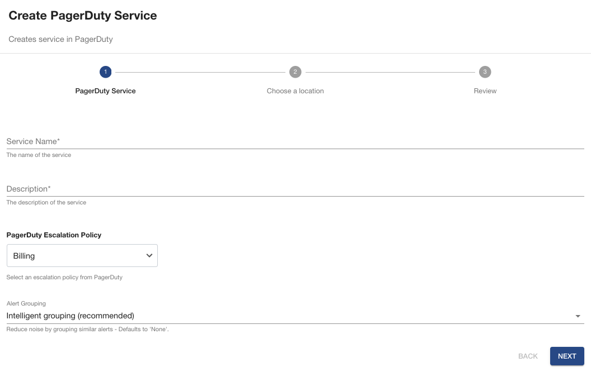

# Release notes for Backend plugin

## > 0.3.1

[GitHub release](https://github.com/PagerDuty/backstage-plugin-backend/releases/tag/0.3.1)

## Summary

This release was aimed at removing the dependency on the Backstage proxy. We have replace it with new REST API endpoints for all operations executed from the frontend plugin that currently interact with the PagerDuty REST API directly. With this change we:

- Removed the dependency on the Backstage proxy
- Improved security by limiting the actions performed on the backend API
- Slightly increase the performance by limiting the data used by the frontend to the essential

**Endpoints added:**

- **/oncall-users** - returns PagerDutyOnCallUsersResponse with list of users oncall
- **/services** - uses integration_key and returns PagerDutyServiceResponse with PagerDuty service information
- **/services/:serviceId** - returns PagerDutyServiceResponse with PagerDuty service information
- **/services/:serviceId/change-events** - returns PagerDutyChangeEventsResponse with list of last 5 change events for the defined service
- **/services/:serviceId/incidents** - returns PagerDutyIncidentsResponse with list of incidents for the defined service

With this change, the proxy configuration on `app-config.yaml` is no longer required.

### Changes

- feat: migrate apis to backend
- build(deps): Bump follow-redirects from 1.15.3 to 1.15.4

## > 0.2.1

[GitHub release](https://github.com/PagerDuty/backstage-plugin-backend/releases/tag/0.2.1)

## Summary

This release introduces the capacity to **enable noise reduction through alert grouping and auto pause of notifications**.

**Note:** This feature requires AIOps. If you don't have the required plan alert grouping will not be enabled.

The user will be able to pass an optional parameter (intelligent, time, content_based) from within a software template and during service creation alert grouping will be enabled automatically and using recommended defaults.

Auto pause of notifications will also be enabled by default.

### Changes

- feat: add support for alert grouping

## > 0.2.0

[GitHub release](https://github.com/PagerDuty/backstage-plugin-backend/releases/tag/0.2.0)

## Summary

This new release introduces local APIs that will support the transition from using the Backstage proxy to call PagerDuty APIs and instead use the local APIs provide by the backend plugin. This will allowed the backend to control which data is exposed to Backstage, replacing the current mechanism that exposes all data returned by PagerDuty APIs.

This release only exposes an API route to get all escalation policies which will work together with the frontend plugin and the scaffolder custom action to replace the existing text field expecting an Escalation Policy Id with a Drop-down control that list all escalation policies available to the user, improving their user experience.

### Changes

- improv(ux): Adding support for escalation policy dropdown on custom action

## > 0.1.2

[GitHub release](https://github.com/PagerDuty/backstage-plugin-backend/releases/tag/0.1.2)

## Summary

This release introduces a scaffolder custom action that allows users to create a PagerDuty service from a Software Template and configure the frontend plugin in one single step. Go [here](https://pagerduty.github.io/backstage-plugin-docs/advanced/create-service-software-template/) to see how to do it.

### Changes

- feat(scaffolder): custom action to create service in PagerDuty
- docs(release): :memo: simplified readme
