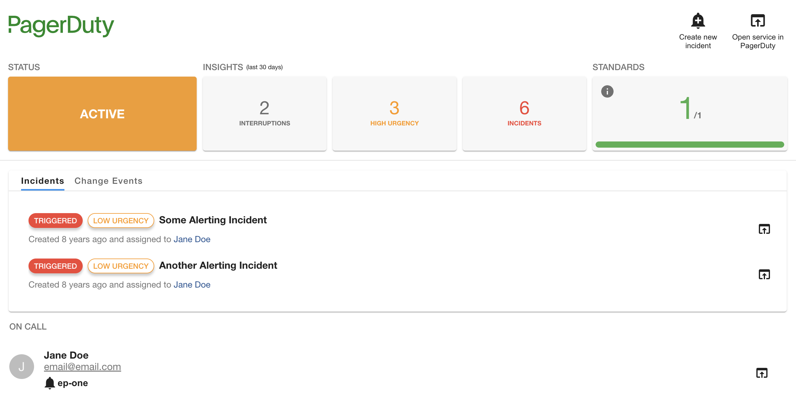

# Release notes for Frontend plugin

## > 0.11.0

[GitHub release](https://github.com/PagerDuty/backstage-plugin/releases/tag/0.11.0)

### Summary

This release introduces a few minor changes and fixes that were part of our roadmap.

- **Users are now able to hide the on-call section**
We introduced a new parameter on the `PagerDutyCard` entity that allows users to completely hide the on-call information section. This feature was mentioned by a few customers and now it is available through an opt-in mechanism.

    ```html
    <EntitySwitch>
      <EntitySwitch.Case if={isPagerDutyAvailable}>
        <Grid item md={12}>
          <EntityPagerDutyCard disableOnCall />
        </Grid>
      </EntitySwitch.Case>
    </EntitySwitch>
    ```

- **Creating an incident is now hidden by default when `integration-key` is missing**
Previously the button to create a new incident was disabled if the `integration-key` configuration was not defined. We have changed that behaviour to completely remove the button from the card as it was causing confusion according to some customers we interviewed.

- **Added documentation on how to disable the change events tab**
The `PagerDutyCard` component already had the capability to completely hide the change events tab by using the `disableChangeEvents` property but this feature was not documented. This information is now part of the official plugin documentation.

    ```html
    <EntitySwitch>
      <EntitySwitch.Case if={isPagerDutyAvailable}>
        <Grid item md={12}>
          <EntityPagerDutyCard disableChangeEvents />
        </Grid>
      </EntitySwitch.Case>
    </EntitySwitch>
    ```

### Changes

- feat: hide on-call information
- feat: hide trigger incident on missing integration key
- chore(deps): bump express from 4.18.2 to 4.19.2
- chore(deps): bump webpack-dev-middleware from 5.3.3 to 5.3.4

### Dependencies

- `@pagerduty/backstage-plugin-backend: ^0.5.1`
- `@pagerduty/backstage-plugin-common: ^0.1.2`

## > 0.10.0

[GitHub release](https://github.com/PagerDuty/backstage-plugin/releases/tag/0.10.0)

### Summary

This release introduces a new UI to the PagerDutyCard that is used on each Entity Page. This new UI introduces:

- official PagerDuty logo
- clear visibility on incident status and urgency
- service status
- service standards
- visibility on service metrics (total incidents, high urgency incidents, total number of interruptions)
- escalation policy information on the on-call section

This release also updates the behaviour of some components from the PagerDutyCard.

- the button to contact the on-call user by email is now removed
- the "create incident" button is now completely hidden in case of `read-only` mode, instead of just disabling the button.



**For Scoped OAuth users** 👉 This release requires you to add additional scopes to your App Registration in PagerDuty: `analytics.read` and `standards.read`.

### Changes

- chore(deps): bump follow-redirects from 1.15.4 to 1.15.6
- style: refresh PagerDutyCard UI

### Dependencies

- `@pagerduty/backstage-plugin-backend: ^0.5.1`
- `@pagerduty/backstage-plugin-common: ^0.1.2`

## > 0.9.3

[GitHub release](https://github.com/PagerDuty/backstage-plugin/releases/tag/0.9.3)

### Summary

This release removes the `pagerDuty.apiToken` and `pagerDuty.oauth` configuration definitions from this repository as they should be treated as secret config and this frontend plugin does not need to know about them.

These configurations will now be exclusive to the backend plugin.

### Changes

- fix: remove config definitions that are secret

## > 0.9.2

[GitHub release](https://github.com/PagerDuty/backstage-plugin/releases/tag/0.9.2)

### Summary

This release resolves an issue reported in backstage-plugin (#74) which prevents users from overriding the REST API base url (e.g. for EU based accounts). This feature was possible through the Backstage proxy configuration.

With this, users will be able to add a new configuration to the PagerDuty plugin in `app-config.yaml` like the example below.

```yaml
pagerDuty:
  apiBaseUrl: https://api.eu.pagerduty.com     #defaults to https://api.pagerduty.com
```

This feature in mainly implemented in `@pagerduty/backstage-plugin-backend` but this release updates the plugin config schema accordingly.

### Changes

- fix: updating config schema to allow overriding of api base url

## > 0.9.1

[GitHub release](https://github.com/PagerDuty/backstage-plugin/releases/tag/0.9.1)

### Summary

This release introduces a security patch to a third-party dependency.

### Changes

- build(deps): Bump ip from 2.0.0 to 2.0.1

## > 0.9.0

[GitHub release](https://github.com/PagerDuty/backstage-plugin/releases/tag/0.9.0)

### Summary

This release adds the type necessary for OAuth support in Backstage plugin configuration. Users can now configure the following OAuth parameters in Backstage `app-config.yaml` file.

```yaml
pagerDuty:
  oauth:
    clientId: ${PD_CLIENT_ID}
    clientSecret: ${PD_CLIENT_SECRET}
    subDomain: ${PD_ACCOUNT_SUBDOMAIN}
    region: ${PD_ACCOUNT_REGION}           // Optional. allowed values: 'us', 'eu'. Defaults to 'us'.
```

It also introduces more friendly error messages when permissions for certain APIs or operations are not present. This was implemented not to break the PagerDuty Card experience.

### Changes

- feat: add suport for Scope OAuth
- fix: update error links to PagerDuty docs

## > 0.8.3

[GitHub release](https://github.com/PagerDuty/backstage-plugin/releases/tag/0.8.3)

### Summary

Version 0.8.3 fixes an issue that was causing an error message to show on-screen for user accounts that don't have AIOPs or Event Intelligence capabilities.


With this changes instead of getting an out-of-context error message users will see this image and message instead.


### Changes

- refactor: improve error handling on client side for change events

## > 0.8.2

[GitHub release](https://github.com/PagerDuty/backstage-plugin/releases/tag/0.8.2)

### Summary

Version 0.8.2 bumps the version of `@pagerduty/backstage-plugin-common` to version 0.0.2.

Version 0.0.1 had a misconfiguration that was forcing the backend plugin to load it as an *ES6 module* and while that's supported for the frontend it is not yet fully supported for backend plugins.

This dependency upgrade syncs the version of the common package between frontend and backend plugins.

### Changes

- chore(deps): bumping up common package version to latest

## > 0.8.1

[GitHub release](https://github.com/PagerDuty/backstage-plugin/releases/tag/0.8.1)

### Summary

This minor release moves the direct REST API calls from the frontend component to the backend. Instead of leveraging the Backstage proxy to make direct API calls to PagerDuty the calls are made to the backend plugin instead.

This removes the dependency on the proxy and prevents other plugins from using the PagerDuty proxy configuration to call PagerDuty APIs directly for other purposes which raises few security concerns.

Therefore the proxy configuration for PagerDuty on app-config.yaml is no longer required and is in-fact deprecated.

### Changes

- feat: migrate api calls
- chore(deps): bump follow-redirects from 1.15.3 to 1.15.4

## > 0.7.4

[GitHub release](https://github.com/PagerDuty/backstage-plugin/releases/tag/0.7.4)

### Summary

This release includes a fix to a bug that prevented the PagerDutyCard from refreshing when users leveraged the Backstage search to navigate between components.

### 🐛 Bug fixes

- fix: component now refreshes when navigating between components from Search

## > 0.7.3

[GitHub release](https://github.com/PagerDuty/backstage-plugin/releases/tag/0.7.3)

### Summary

This release updates the Backstage plugin configuration schema to add support for `apiToken`.

```yaml
pagerDuty:
   apiToken: u+a81u12y4ax
```

The latest release of the backend plugin ([0.2.0](https://github.com/PagerDuty/backstage-plugin-backend/releases/tag/0.2.0)) required a schema change for the plugin to start successfully. It does not introduce new features or capabilities to this plugin but it makes sure that the schemas match and avoid misconfigurations.

### 🔧 Maintenance

- chore(schema): updated config schema to match backend plugin

## > 0.7.2

[GitHub release](https://github.com/PagerDuty/backstage-plugin/releases/tag/0.7.2)

### Summary

This release fixes an issue that prevented the installation of the plugin if the Backstage React version was not compatible with the plugin version. It also fixes a moderate security issue, adds support for React 18+ and bumps up the versions of Backstage packages.

### 🔧 Maintenance

- chore(deps): add support for React 18+ (#43)
- chore(deps): bump up Backstage versions (#44)
- docs: Simplify readme file and point to full documentation (#47)
- chore(deps): bump @adobe/css-tools from 4.3.1 to 4.3.2
- fix: move strict dependencies

## > 0.7.1

[GitHub release](https://github.com/PagerDuty/backstage-plugin/releases/tag/0.7.1)

### Summary

With release 0.7.1 we have fixed some issues and added new capabilities to the oncall user list.

- List only users in escalation level 1 - these are the users that are actually oncall.
- Remove duplicate users from the oncall user list
- Add support for user profile picture and fallback to dummy avatar icon when an image is not provided.

### 🌟 Minor Changes

- fix: list only oncall users in plugin

## > 0.7.0

[GitHub release](https://github.com/PagerDuty/backstage-plugin/releases/tag/0.7.0)

### Summary

This release marks the first version under PagerDuty's ownership of the Backstage plugin. You will not notice any major changes. Here's what we did:

- Fixed a bug that was preventing recent changes tab to show
- Removed double headers on plugin UI component for incidents and recent changes
- Patched potential security vulnerabilities on dependencies

### 🔧 Maintenance

- chore(deps): bump zod from 3.22.2 to 3.22.4
- chore(deps): bump browserify-sign from 4.2.1 to 4.2.2
- chore(deps): bump @babel/traverse from 7.22.20 to 7.23.2
- chore(deps): bump postcss from 8.4.29 to 8.4.31
- chore(ci): adding release drafter with config
- chore(deps)Bump graphql from 16.8.0 to 16.8.1
- chore(ci): adding github action to publish package on new release
- chore(docs): adding CODEOWNERS
- chore(ci): changing release step to trigger on pr close and merge
- chore(ci): forcing npm registry by default
- chore(ci): Build and publish package to npm

### 🌟 Minor Changes

- fix(ui): Removing sub-headers from lists
